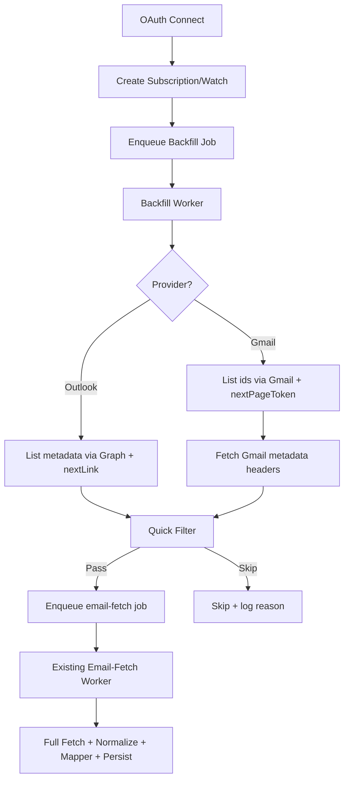

# Backfill Flow (Outlook + Gmail)

This module backfills historical booking emails after mailbox connection.
It is async, queue-based, and reuses the same downstream processing pipeline.

## Goal

Fetch old emails efficiently, filter fast, and push only relevant message IDs.

## Shared Flow

1. User connects mailbox via OAuth.
2. Subscription/watch is created for future emails.
3. Backfill job is enqueued in `backfill` queue with `mailboxId` + `provider`.
4. Backfill worker calls provider-specific backfill service.
5. Service fetches metadata in batches and applies quick filter.
6. Valid `messageId`s are enqueued to existing `email-fetch` queue.
7. Existing email-fetch worker fetches full email and runs normalize + mapper.

## Components

- Queue: `src/backfill/queues/backfill.queue.ts`
- Worker: `src/backfill/workers/backfill.worker.ts`
- Outlook service: `src/backfill/services/outlook-backfill.service.ts`
- Gmail service: `src/backfill/services/gmail-backfill.service.ts`
- Trigger: `src/auth/controllers/oauth.controller.ts`
- Reused pipeline queue: `src/webhook/queues/queue.ts`

## Job Payloads

### Backfill Queue

```json
{ "mailboxId": "<mailbox-id>", "provider": "outlook|gmail" }
```

### Email Fetch Queue

```json
{
  "provider": "outlook|gmail",
  "mailboxId": "<mailbox-id>",
  "emailAddress": "<mailbox-email>",
  "messageId": "<provider-message-id>",
  "source": "backfill"
}
```

## Provider Differences

- Outlook list API: `GET /me/messages`
- Outlook pagination: `@odata.nextLink`
- Outlook lightweight fields: `id,subject,from,receivedDateTime`

- Gmail list API: `GET /gmail/v1/users/me/messages`
- Gmail pagination: `nextPageToken`
- Gmail metadata fetch per message: `format=metadata` with `Subject` + `From` headers

## Concurrency and Safety

- Backfill worker concurrency: `2`
- Backfill queue retries: exponential backoff
- API rate-limit handling: retries + small delay between pages
- Email-fetch queue dedupe: provider + mailbox identity + messageId

## Diagram



## Notes

- Backfill only does fetch metadata -> filter -> enqueue.
- Full processing always stays in existing email-fetch pipeline.
